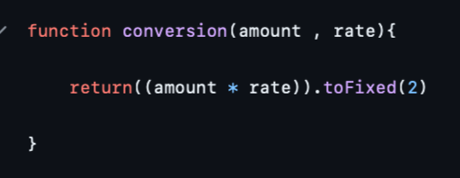

# Summative 1

## Currency Converter

I have designed a webpage that allows users to convert currencies. The application connects to the [Exchange rate API](https://www.exchangerate-api.com) and collects live currency data, allowing users to convert from one currency to another at the click of a button.

A user can enter their desired amount, choose the ‘from’ currency (located on the left) and ‘to’ currency (on the right). By clicking the ‘convert’ button, the application will convert the currency in real-time. Moreover, the application includes the ability to swap currencies by clicking the swap icon in the middle.

### Purpose of the Currency Converter Application

My workplace oversees much of the transport industry in the United Kingdom. We frequently encounter the challenge of dealing with costs and fees that have international implications. For example, train fares, fuel prices, and expenses from overseas freight suppliers. Having the ability to convert currencies using live data helps my organisation tackle these challenges and is crucial for strategic planning and analysis. Below are a few specific benefits of this application:

- Compare prices against international standards – Users can instantly see how prices and costs match against different foreign markets.
- Improve reporting accuracy – having live data allows my workplace to get the most up-to-date conversion in their reports.
- Support international strategic decisions – help decision making by having access to reliable comparison between costs internationally.

By developing and integrating this application in my workplace, we can ensure we have access to the most accurate conversion data, aiding confidence in our international decision making.

### Initial design

I designed my currency converter using Figma. I wanted the design to be minimalistic and simple to avoid overcrowding. After receiving feedback from a colleague, they liked the simple design but mentioned it could benefit from using a ‘To’ and ‘From’ label for the currency tabs. Although intuitively the conversion would occur from left to right this would clear up any confusion.

#### Project planning

Prior to building the application, I decided to create small tasks that would incrementally build on each other to form a minimum viable product. Using a GitHub project Kanban board, I outlined the requirements that could be traced.

By following the Agile methodology, I worked in continuous sprints to complete each ticket/task. A sprint is a set period in which a task has to be completed, They encourage projects to be built faster while keeping the workload manageable.

The tickets were designed so each ticket would add a distinct feature. I added several labels to the tickets outlining brief user requirements such as Java, HTML, etc., and I assigned each ticket to myself and the project board. When a ticket was being worked on, I could create a GitHub branch from that ticket to carry out the required task.

The application needed a few key requirements, including:

- **Setup of the page** – I setup the base .html,.css and .js files for the core repository setup.

- **Initial page styling** – Using HTML and CSS, I constructed the application pages. It was important that the HTML was set up so that it could depend on the JavaScript manipulation.

- **Connect to a currency API** To gather the live currency data, I used an API key to connect to the exchange rate API and extracted the optional currencies along with their data. This means that each time the page loads, the app will connect to the API and supply the user with currencies they can choose from.

- **Currency conversion logic** – The user can type in a valid number, select their desired current exchanges, and when they click convert, it will output the converted result. This section relied on extracting the currency information and multiplying it by the user input within a JavaScript function.

### Test Driven Development

Test driven development focuses on testing code during the development process. I incorporated unit tests into my code using the JavaScript package Jest.
Jest is a JavaScript framework designed to ensure the correctness of any JavaScript codebase. You can write unit tests that can run quickly on demand.

TDD is designed so that the tests create a rigid structure for any codebase, potentially reducing errors. Although TDD may be timely, it has been found to significantly reduce the costs of the development process.

I created several tests to check whether an incorrect user input would throw an error or give out the correct response message and whether the conversion logic output was correct.

#### GitHub Actions

As part of the continuous integration and continuous development pipeline, I setup GitHub actions using the workflow's **ci.yml** file. This would ensure that on each pull request or push to the main branch, the application would be tested, displaying the results within the ‘Actions’ section in GitHub.

I ran the tests to check whether the outputs were correct. Jest allowed me to create a mock HTML input and manipulate the results. The test expected a string value of “41.41” but received a floating-point value of 41.049999, marking the test as failed.

I then fixed this error by adding *.toFixed(2)* which would round the result to 2 decimal places.

The tests ran successfully and were marked as green on the GitHub actions page.

### Adding features

After I created the MVP, I decided to add some additional features. A huge concern for me was that the application’s core function relied solely on the exchange rate API. This meant that if the API connection failed or the API usage ran out, the app would no longer work. Therefore, I decided to add a hardcoded currency conversion block. If the API failed, the code would switch to using the hardcoded values instead. Although limited, it still gave the application functionality with brief values when the API was not available.

I added this as an issue/ticket on the Kanban board and created a GitHub branch.

I then worked on application code, so if the API failed, it would catch the error and resort to the default values function displaying this information instead.

This feature affected the test results as it changed how the programme responded to errors. Before adding this feature, the test would expect an error message if the API failed. Now that the feature has been added, an error message is no longer present. Therefore, I changed the test so it would pick up the newly added result.

I regularly pushed changes to GitHub, and when I was happy with this new feature, I submitted a pull request. Typically, within a team, I would assign this to my colleague; however, as I’m working on this project alone, I assigned myself. Once I approved the pull request, I merged the branch into main, where it can be seen as the most up-to-date working code.

## Documentation

### Getting started

##### Prerequisites
- Modern web browsers such as Google Chrome, Edge, or Safari.
- Internet connection for getting live currency data.
- Code editor such as Visual Studio.

##### Installation
1. Clone the repository.

2. Within the repository, open the **converter.html** file with a live web server to start using the application.

##### Usage

1. Enter the amount you want to convert into the input field.
2. Select the 'to' and 'from' currencies using the drop down menu.
3. Click convert to see the conversion result.
4. The swap button can be used to toggle between the 'to' and 'from' currencies.

### Technical overview

##### Key application files

- **About.html** – basic webpage displaying information about the application and context.
- **Converter.html** webpage for the actual currency converter.
- **Index.html** – basic start page of the website.
- **Styles.css** - the CSS file to design the webpage.
- **App.js** – JavaScript code containing key currency conversion functions.

##### Key testing files

- **App.test.js** – testing file for the currency conversion app.js file.
- **Jest.config.js** – key js file to configure Jest settings.

### Functional Description

When the currency converter webpage is loaded, the app.js automatically calls the ‘get_codes()’ function. This attempts to connect to the currency exchange API and retrieve the current currency codes. These codes are then stored as an option in the HTML script, so a user can select the currency of their choice. If the API fails, the function calls the ‘use_hardcoded()’ function, where the code will assign the hard coded currencies as selection options, these include GBP, EUR, and USD.

Once the currencies are selected and a user enters in a valid value, the covert button can be pressed, triggering the ‘convertCurrency()’ function. This function calls the exchange rate API to extract the live rates. The amount entered and the live rate are input into the conversion function, where they are multiplied together, giving the converted result. This result is then displayed on the user's screen. Again, if the API call fails at this stage, the programme will catch the error and call the ‘use_hardcoded()’ function, allowing the user to pick GBP, EUR, or USD and convert offline.

##### Key notes:

The application relies heavily on the [Exchange rate API](https://www.exchangerate-api.com), which requires a free API key that is used to query the conversion rates. This has a **limit of 1500 calls** per month. If the application makes more than 1500 calls within a single month, it will default to using the hardcoded values.

### Evaluation

Overall, I am very happy with the initial outcome of my minimum viable product. It allows users to easily convert currencies, catches errors, and defaults to manual coded values when the API fails. However, I believe the design of the code and UI can be improved to help aid future additions.

Firstly, each time the web page loads, the programme queries the API for the currency code information, using one of the limited API calls. This could be avoided by querying the currency code information only once and storing it in a static file that can be accessed by the webpage, avoiding many API calls. On the other hand, a downside of this feature is that the application could miss any new currencies added to the website, for example, if crypto currencies are added in the future. However, this wouldn’t happen often as it’s a one-time update.

Secondly, the use of a .env file could be integrated to store my API key. For security reasons, my organisation may not want to display API keys or passwords on a GitHub repository. Storing my API key in a .env file and adding it to the .gitignore file would avoid unauthorised users being able to access credentials.

Finally, initial conversion functions could be further separated into more specific purposes, for example, API querying, DOM manipulation, and logical processes. The current code contains a lot of these sub operations within single functions; for example, the get_codes() function queries the API, ,extracts the information, and adds it to the HTML . Separating these processes improves code readability and makes way for future developments.

The application works well for its purpose , however, future designs should be secure and maintainable, offering a foundation for future developments .

